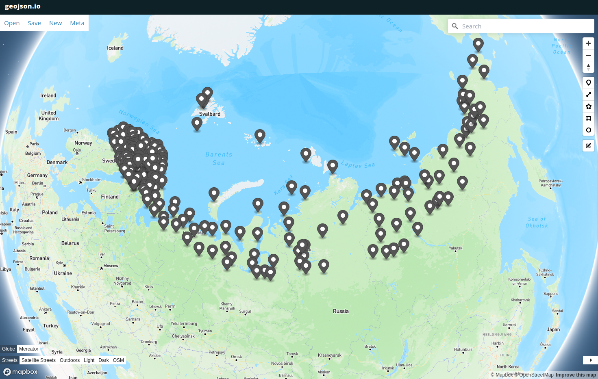
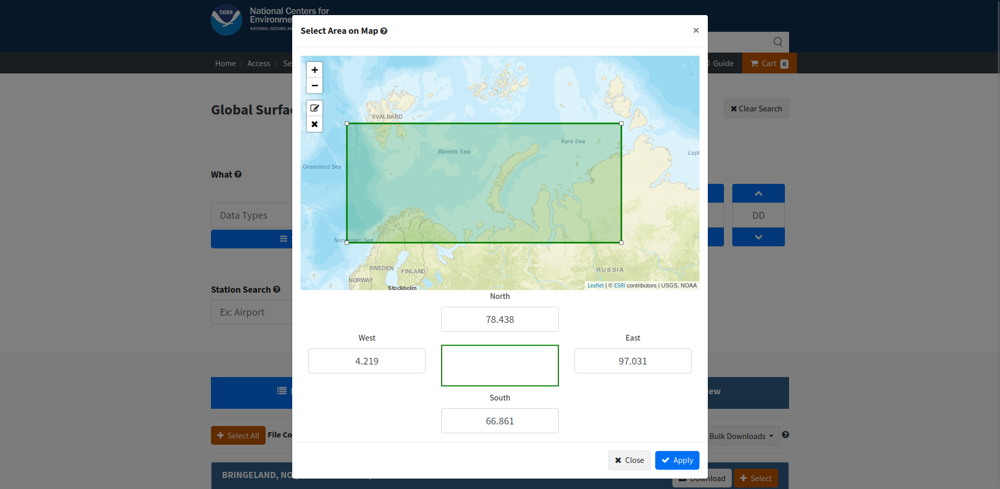

#### Скрипт для загрузки геоданных с [сайта NCEI](https://www.ncei.noaa.gov/).
Алгоритм загрузка:
- Устанавливается дата для интересующих данных
- Скрипт парсит парсит страницу с [сайта](https://www.ncei.noaa.gov/data/global-summary-of-the-day/access/) и ищет ссылки на датасеты
- Скрипт загружает датасеты по всем интересующим станциям указанных в файле stations.txt
- Местонахождение станций можно отфильтровать, удалив или добавив интересующие:
- Местонахождение станций можно посмотреть на [сайте](https://geojson.io) вставив geojson в правое окно как на примере ниже.

- Местонахождение новых интересующих нас станций можно поискать на [сайте](https://www.ncei.noaa.gov/access/search/data-search/global-summary-of-the-day)
изменив зону поиска и посмотрев находящиеся внутри полигона ID станций.

- Данные загружаются в формате csv большими порциями, внутри которых присутствуют данные
и за другие даты _можно оптимизировать_
- Скрипт загруженных файлах строки с интересующей датой. В случае
успеха добавляет их в Feature Collection формата GeoJSON.
- По окончанию анализа всех файлов дампит файл result.geojson (пример файла приведен example.geojson)
