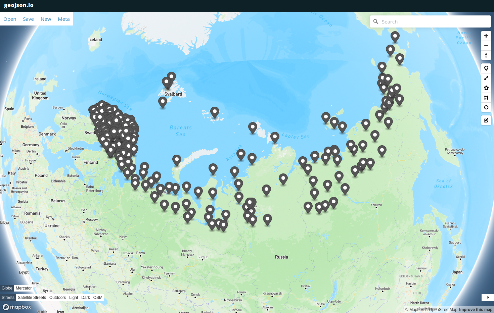
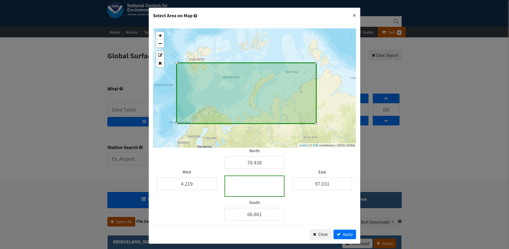

#### Скрипт для загрузки геоданных с [сайта NCEI](https://www.ncei.noaa.gov/).
Алгоритм загрузка:
- Скрипт на вход получает дату, за которую необходимо найти данные.
- Скрипт парсит [страницу](https://www.ncei.noaa.gov/data/global-summary-of-the-day/access/) и ищет ссылки на датасеты.
- Скрипт загружает датасеты с указанными в <code>stations.txt</code> ID станций. Станции можно удалять или добавлять новые.
- Текущее расположение станций и их характеристики можно посмотреть на [geojson.io](https://geojson.io) _(пример на картинке)_ вставив в окно спарва текущий geojson _(находится в public/example.geojson)._

- Местонахождение станций можно поискать на [официальном сайте](https://www.ncei.noaa.gov/access/search/data-search/global-summary-of-the-day)
изменив зону поиска и посмотрев находящиеся внутри полигона ID станций.

- Данные загружаются в формате csv большими порциями, внутри которых присутствуют данныеи за другие даты _(можно оптимизировать)_
- Скрипт ищет в загруженных файлах строки с заданной датой. В случае успеха добавляет их как объект Feature в Feature Collection формата GeoJSON.
- По окончанию анализа всех файлов дампит файл <code>result.geojson</code>.

_Образец получаемых данных:_
```json
{
    "type": "FeatureCollection",
    "features": [
        {
            "type": "Feature",
            "geometry": {
                "type": "Point",
                "coordinates": [
                    11.933333,
                    78.916667
                ]
            },
            "properties": {
                "STATION": 1007099999,
                "DATE": "2022-02-02",
                "ELEVATION": 7.7,
                "NAME": "NY ALESUND, SV",
                "TEMP": 13.5,
                "TEMP_ATTRIBUTES": 5,
                "DEWP": 5.4,
                "DEWP_ATTRIBUTES": 5,
                "SLP": 1014.3,
                "SLP_ATTRIBUTES": 5,
                "STP": 13.3,
                "STP_ATTRIBUTES": 5,
                "VISIB": 999.9,
                "VISIB_ATTRIBUTES": 0,
                "WDSP": 5.2,
                "WDSP_ATTRIBUTES": 5,
                "MXSPD": 8.0,
                "GUST": 17.1,
                "MAX": 18.1,
                "MAX_ATTRIBUTES": " ",
                "MIN": 10.4,
                "MIN_ATTRIBUTES": " ",
                "PRCP": 0.0,
                "PRCP_ATTRIBUTES": "I",
                "SNDP": 999.9,
                "FRSHTT": 0
            }
        }
    ]
}
```
